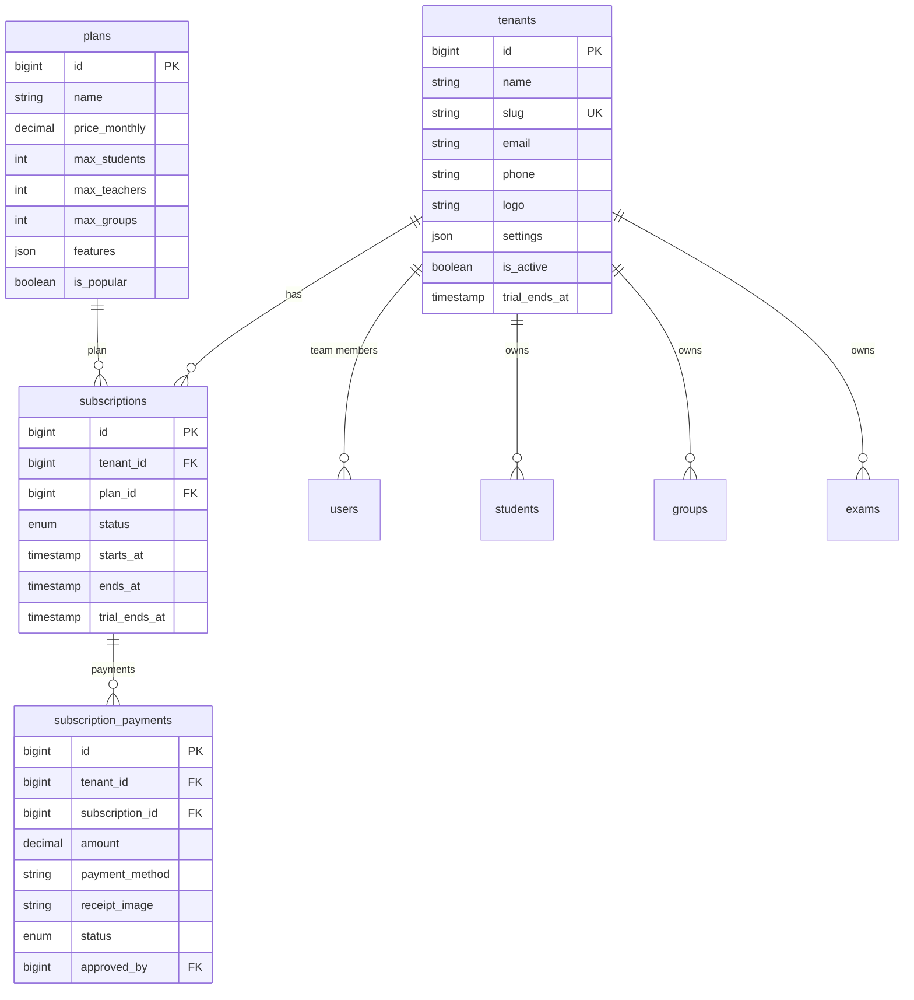

# 🏗️ خطة تحويل المنصة التعليمية إلى SaaS (النسخة النهائية)

## ملخص المشروع

تحويل النظام الحالي (Single-Tenant) إلى **منصة SaaS** واحدة تخدم مئات المدرسين، كل مدرس بداتا معزولة تماماً، مع 3 بوابات + موقع تعريفي + صفحة تسعير.

---

## ✅ القرارات المحسومة

| البند | القرار |
|---|---|
| **Git** | Branch جديد `saas` في نفس الريبو — النسخة الحالية على `main` تفضل شغالة |
| **Routing** | **Path-based** على الـ subdomain: `saas.domain.com/t/{slug}/...` |
| **دفع الاشتراكات** | يدوي — **InstaPay + Vodafone Cash** (نفس أسلوب دفع ولي الأمر بالظبط: تحويل + رفع إيصال + اعتماد من الأدمن) |
| **بوابة الطالب** | تسجيل دخول بـ **كود الطالب + رقم هاتف الطالب** (الأنسب لأن الكود فريد ورقم الهاتف يأكد الهوية بدون إنشاء حساب) |
| **التسعير** | 3 خطط (بداية / نمو / احتراف) — **بدون رسوم إعداد** — **شهري فقط** — **أسبوع مجاني** للجميع |
| **المساعدين** | المدرس يقدر يضيف مساعدين (الحد حسب الخطة) |
| **Super Admin** | Filament Panel ثاني لصاحب المنصة لإدارة المدرسين والاشتراكات |

---

## 🔍 الوضع الحالي

| البند | الحالة |
|---|---|
| **Stack** | Laravel 12 / PHP 8.2+ / Filament v3 / MySQL / Vite |
| **Database** | 26 جدول بدون `tenant_id` |
| **Filament** | 18 Resource + 8 Pages + 8 Widgets |
| **Services** | 14 service class |
| **Auth** | Filament Login + Spatie Permission + Session parent portal |
| **Git** | `main` branch — `github.com:Diaa-Ashraf/elgendy.git` |
| **Hosting** | Shared Hosting — المشروع على subdomain |

---

## Proposed Changes

---

### المرحلة 0: إعداد الـ Branch الجديد

```bash
git checkout -b saas
git push origin saas
```

- النسخة الحالية تفضل على `main` شغالة
- كل شغل الـ SaaS على `saas` branch
- لما الـ SaaS يخلص ويتجرب → يترفع على الـ subdomain بتاعه

---

### المرحلة 1: البنية التحتية للـ Multi-Tenancy

> هذه المرحلة هي الأساس — كل حاجة بعدها بتعتمد عليها.

#### [NEW] Migration: `create_tenants_table`
```sql
tenants
├── id (bigint PK)
├── name (string) — "سنتر الأستاذ أحمد"
├── slug (string UNIQUE) — "mr-ahmed" (يُستخدم في الـ URL)
├── email (string)
├── phone (string)
├── logo (string nullable)
├── favicon (string nullable)
├── is_active (boolean default true)
├── trial_ends_at (timestamp nullable)
├── settings (JSON) — كل إعدادات المدرس (بدل جدول settings منفصل)
├── created_at
└── updated_at

INDEX: slug (unique)
INDEX: is_active
```

#### [NEW] Migration: `create_plans_table`
```sql
plans
├── id (bigint PK)
├── name (string) — "بداية" / "نمو" / "احتراف"
├── slug (string UNIQUE)
├── price_monthly (decimal 8,2) — السعر الشهري
├── max_students (int) — حد الطلاب
├── max_teachers (int default 1) — حد المساعدين
├── max_groups (int) — حد المجموعات
├── features (JSON) — المميزات الإضافية
├── is_popular (boolean default false) — للـ badge "الأكثر طلباً"
├── is_active (boolean default true)
├── sort_order (int default 0)
├── created_at
└── updated_at
```

**البيانات الأولية للخطط:**

| الخطة | السعر/شهر | طلاب | مساعدين | مجموعات |
|---|---|---|---|---|
| بداية | 299 ج.م | 30 | 1 (المدرس فقط) | 15 |
| نمو | 499 ج.م | 100 | 3 | 50 |
| احتراف | 699 ج.م | غير محدود | 50 | 200 |

> [!TIP]
> **ليه بدون رسوم إعداد؟** رسوم الإعداد بتضيف احتكاك (friction) وبتخلي المدرس يتردد. الأفضل خطة شهرية واضحة + أسبوع مجاني يجرب فيه بدون دفع. ده اللي بيحقق أعلى conversion rate.

#### [NEW] Migration: `create_subscriptions_table`
```sql
subscriptions
├── id (bigint PK)
├── tenant_id (FK → tenants)
├── plan_id (FK → plans)
├── status (enum: trial / active / past_due / expired / cancelled)
├── starts_at (timestamp)
├── ends_at (timestamp nullable)
├── trial_ends_at (timestamp nullable)
├── created_at
└── updated_at

INDEX: (tenant_id, status)
```

#### [NEW] Migration: `create_subscription_payments_table`
```sql
subscription_payments
├── id (bigint PK)
├── tenant_id (FK → tenants)
├── subscription_id (FK → subscriptions)
├── amount (decimal 10,2)
├── payment_method (string: instapay / vodafone_cash)
├── sender_phone (string nullable)
├── transaction_reference (string nullable)
├── receipt_image (string) — صورة الإيصال
├── period_month (date) — الشهر المدفوع عنه
├── status (enum: pending / approved / rejected)
├── rejection_reason (text nullable)
├── approved_by (FK → users nullable)
├── approved_at (timestamp nullable)
├── notes (text nullable)
├── created_at
└── updated_at

INDEX: (tenant_id, status)
INDEX: created_at
```

#### [NEW] Migration: `add_tenant_id_to_all_tables`

إضافة عمود `tenant_id` (FK → tenants, indexed) لكل الجداول التالية:

```
users, students, educational_stages, subjects, groups,
group_schedules, group_sessions, group_student, attendances,
student_payments, salaries, exams, exam_results, questions,
exam_questions, online_exam_attempts, expense_categories,
expenses, inventory_items, inventory_movements, discounts,
student_applications, study_materials, student_material_deliveries,
online_payment_requests, student_imports
```

> [!IMPORTANT]
> جدول `settings` القديم هيتشال — كل إعدادات المدرس هتتخزن في `tenants.settings` (JSON column). ده أسرع وأنظف من query كل مرة على جدول منفصل.

---

#### [NEW] `app/Models/Tenant.php`

```php
class Tenant extends Model
{
    // relationships: users(), subscription(), students(), groups(), ...
    // helper: getSetting($key, $default), setSetting($key, $value)
    // helper: isTrialing(), isActive(), isExpired()
    // helper: hasReachedStudentLimit(), hasReachedGroupLimit()
}
```

#### [NEW] `app/Models/Plan.php`
#### [NEW] `app/Models/Subscription.php`
#### [NEW] `app/Models/SubscriptionPayment.php`

---

#### [NEW] `app/Traits/BelongsToTenant.php`

```php
trait BelongsToTenant
{
    public static function bootBelongsToTenant(): void
    {
        // 1. Global Scope: يضيف WHERE tenant_id = ? على كل query تلقائياً
        static::addGlobalScope('tenant', function ($query) {
            if ($tenantId = app(TenantContext::class)->id()) {
                $query->where($query->getModel()->getTable().'.tenant_id', $tenantId);
            }
        });

        // 2. Creating Observer: يضيف tenant_id تلقائياً عند إنشاء record جديد
        static::creating(function ($model) {
            if (!$model->tenant_id && $tenantId = app(TenantContext::class)->id()) {
                $model->tenant_id = $tenantId;
            }
        });
    }

    public function tenant(): BelongsTo
    {
        return $this->belongsTo(Tenant::class);
    }
}
```

#### [NEW] `app/Services/TenantContext.php`

```php
// Singleton — يحتفظ بالـ Tenant الحالي
// يُضبط من:
//   - ResolveTenant middleware (web requests)
//   - يدوياً في Queue Jobs (عن طريق tenant_id parameter)
//   - Console commands
class TenantContext
{
    private ?Tenant $tenant = null;

    public function set(Tenant $tenant): void { ... }
    public function get(): ?Tenant { ... }
    public function id(): ?int { ... }
    public function require(): Tenant { ... } // throws if no tenant
}
```

#### [NEW] `app/Http/Middleware/ResolveTenant.php`

```php
// 1. يقرأ {tenant} slug من الـ route parameter
// 2. يجيب الـ Tenant من الـ DB (cached)
// 3. لو مش موجود أو is_active = false → abort 404
// 4. لو الاشتراك منتهي → redirect لصفحة التجديد
// 5. يحط الـ Tenant في TenantContext
```

#### [NEW] `app/Http/Middleware/CheckSubscription.php`

```php
// يتحقق إن الـ tenant عنده اشتراك فعال أو في الفترة التجريبية
// لو الاشتراك منتهي → يعرض صفحة "اشتراكك انتهى، جدد الآن"
// لو وصل حد الطلاب/المجموعات → يعرض رسالة ترقية
```

---

#### [MODIFY] كل Models الموجودة (26 model)

إضافة `use BelongsToTenant;` trait:

| Model | يحتاج Trait؟ |
|---|---|
| User | ✅ |
| Student | ✅ |
| Group | ✅ |
| Exam | ✅ |
| Question | ✅ |
| StudentPayment | ✅ |
| Attendance | ✅ |
| وباقي الـ 19 model... | ✅ |
| Tenant, Plan, Subscription | ❌ (جداول المنصة) |

#### [MODIFY] [User.php](file:///d:/project/mohammed_elgandy/app/Models/User.php)
- إضافة `tenant_id` + `BelongsToTenant` trait
- إضافة `tenant()` relationship
- تعديل `canAccessPanel()` للتحقق من الـ tenant والاشتراك

---

### المرحلة 2: تعديل Filament Panels

#### [MODIFY] [AdminPanelProvider.php](file:///d:/project/mohammed_elgandy/app/Providers/Filament/AdminPanelProvider.php)

```php
// التعديلات:
// 1. تفعيل Filament tenancy المدمج
->tenant(Tenant::class, slugAttribute: 'slug')

// 2. تغيير الـ path
->path('t/{tenant}/admin')

// 3. الـ brand name واللوجو ديناميك من الـ tenant
->brandName(fn () => Filament::getTenant()?->name ?? 'المنظومة التعليمية')
->brandLogo(fn () => Filament::getTenant()?->logo_url)
```

#### [NEW] `app/Providers/Filament/SuperAdminPanelProvider.php`

```php
// Panel ثاني لصاحب المنصة (أنت)
// Path: /super-admin
// Resources: TenantResource, PlanResource, SubscriptionResource, SubscriptionPaymentResource
// لا يستخدم tenancy — يشوف كل البيانات
// Auth: فقط users بـ role "super_admin"
```

#### [NEW] Filament Resources للـ Super Admin

| Resource | الوظيفة |
|---|---|
| `TenantResource` | إدارة المدرسين (إضافة/تعديل/تعطيل tenant) |
| `PlanResource` | إدارة خطط التسعير |
| `SubscriptionResource` | عرض ومتابعة الاشتراكات |
| `SubscriptionPaymentResource` | مراجعة واعتماد/رفض إيصالات الدفع (زي OnlinePaymentRequestResource بالظبط) |

#### [MODIFY] كل Filament Resources الحالية (18 resource)
- التأكد إن الـ Global Scope كافي (في الغالب كافي لأن Filament بيعمل scope تلقائي مع `->tenant()`)
- أي `relationship()` فيها queries يدوية → مراجعة

#### [MODIFY] [ManageSettings.php](file:///d:/project/mohammed_elgandy/app/Filament/Pages/ManageSettings.php)
- التعديل ليقرأ ويكتب من `Filament::getTenant()->settings` (JSON) بدل جدول `settings`
- نفس الـ UI بالظبط — بس مصدر البيانات مختلف

#### [MODIFY] [AdvancedAnalytics.php](file:///d:/project/mohammed_elgandy/app/Filament/Pages/AdvancedAnalytics.php)
- إن الـ queries فيها tenant-scoped (الـ Global Scope هيغطيها)

#### [MODIFY] باقي الـ Pages والـ Widgets
- مراجعة إن الـ Global Scope شغال صح في كل query

---

### المرحلة 3: بوابة الطالب (Student Portal) ← جديدة بالكامل

#### [NEW] `app/Http/Controllers/StudentPortalController.php`

```php
class StudentPortalController extends Controller
{
    public function showLogin(Tenant $tenant) { ... }

    public function login(Request $request, Tenant $tenant)
    {
        // التحقق بـ: كود الطالب (student ID) + رقم هاتف الطالب
        // لو البيانات صح → session(['student_portal_id' => $student->id])
        // لو غلط → رسالة خطأ واضحة بالعربي
    }

    public function dashboard(Tenant $tenant) { ... }
    // عرض: المجموعات، الجدول، آخر 10 حضور/غياب، آخر نتائج امتحانات

    public function exams(Tenant $tenant) { ... }
    // قائمة الامتحانات المتاحة + حالة كل امتحان (لم يبدأ / تم الحل / انتهى الوقت)

    public function startExam(Tenant $tenant, int $examId) { ... }
    public function submitExam(Request $request, Tenant $tenant, int $examId) { ... }
    public function examResult(Tenant $tenant, int $examId) { ... }

    public function materials(Tenant $tenant) { ... }
    // المذكرات المتاحة للمرحلة + حالة الاستلام

    public function profile(Tenant $tenant) { ... }
    // بيانات الطالب الشخصية (عرض فقط)
}
```

#### [NEW] Views: `resources/views/student-portal/`

```
layout.blade.php         — Layout مشترك (navbar + sidebar + footer) بألوان الـ tenant
login.blade.php          — صفحة دخول الطالب
dashboard.blade.php      — لوحة الطالب الرئيسية
exams/list.blade.php     — قائمة الامتحانات
exams/take.blade.php     — شاشة أداء الامتحان (نفس المحرك الحالي)
exams/result.blade.php   — نتيجة الامتحان
materials.blade.php      — المذكرات
profile.blade.php        — البيانات الشخصية
```

> [!TIP]
> محرك الامتحان الأونلاين الموجود حالياً في بوابة ولي الأمر هيتنقل لبوابة الطالب (مكانه الصح)، ويفضل متاح في بوابة ولي الأمر كـ "عرض فقط" للنتائج.

---

### المرحلة 4: تعديل بوابة ولي الأمر (Tenant-Aware)

#### [MODIFY] [ParentPortalController.php](file:///d:/project/mohammed_elgandy/app/Http/Controllers/ParentPortalController.php)

```php
// التعديلات:
// 1. كل method يستقبل Tenant $tenant كـ parameter
// 2. التأكد إن الطالب ينتمي لنفس الـ tenant
// 3. عرض اللوجو واسم السنتر من الـ tenant
// 4. الامتحانات الأونلاين تتشال من هنا (تتنقل لبوابة الطالب)
//    ويفضل هنا عرض النتائج فقط
```

#### [MODIFY] [OnlineExamController.php](file:///d:/project/mohammed_elgandy/app/Http/Controllers/OnlineExamController.php)
- تعديل ليشتغل مع بوابة الطالب بدل بوابة ولي الأمر
- إضافة tenant parameter

---

### المرحلة 5: الموقع التعريفي لكل مدرس (Tenant-Aware)

#### [MODIFY] [HomeController.php](file:///d:/project/mohammed_elgandy/app/Http/Controllers/HomeController.php)

```php
// التعديلات:
// 1. يستقبل Tenant $tenant من الـ route
// 2. الإعدادات تتجاب من $tenant->settings (JSON) بدل SettingService
// 3. الـ stages, groups, subjects → scoped بالـ tenant_id
```

#### [MODIFY] [landing.blade.php](file:///d:/project/mohammed_elgandy/resources/views/landing.blade.php)
- نفس التصميم الحالي — بس ديناميك حسب الـ tenant
- اللوجو، الألوان، المحتوى كله من إعدادات الـ tenant

---

### المرحلة 6: صفحة المنصة الرئيسية + التسعير + تسجيل المدرسين

#### [NEW] `app/Http/Controllers/PlatformController.php`

```php
class PlatformController extends Controller
{
    public function home() { ... }
    // الصفحة الرئيسية للمنصة — تعريف بالخدمة ومميزاتها

    public function pricing() { ... }
    // 3 خطط تسعير (بداية / نمو / احتراف) — بدون رسوم إعداد

    public function register() { ... }
    // تسجيل مدرس جديد → إنشاء tenant + user + trial subscription

    public function login() { ... }
    // تسجيل دخول مدرس حالي → redirect لـ Filament panel بتاعه
}
```

#### [NEW] Views: `resources/views/platform/`

```
home.blade.php       — الصفحة الرئيسية (Hero + مميزات + شهادات + CTA)
pricing.blade.php    — صفحة التسعير (3 كروت بتصميم premium مميز)
register.blade.php   — تسجيل مدرس جديد (اسم + إيميل + هاتف + كلمة سر + اسم السنتر)
login.blade.php      — تسجيل دخول مدرس
```

**تصميم صفحة التسعير:**

```
┌──────────────────────────────────────────────────────────────┐
│                                                              │
│   اختر الخطة المناسبة لحجم سنترك ← عنوان رئيسي             │
│   جرّب مجاناً لمدة أسبوع كامل بدون أي التزام ← عنوان فرعي  │
│                                                              │
│  ┌─────────────┐  ┌─────────────────┐  ┌──────────────────┐  │
│  │   بداية     │  │  ⭐ نمو         │  │   احتراف         │  │
│  │             │  │  الأكثر طلباً   │  │                  │  │
│  │  299 ج.م    │  │  499 ج.م        │  │  699 ج.م         │  │
│  │  /شهر       │  │  /شهر           │  │  /شهر            │  │
│  │             │  │                 │  │                  │  │
│  │ ✓ 30 طالب   │  │ ✓ 100 طالب     │  │ ✓ طلاب غير محدود │  │
│  │ ✓ 15 مجموعة │  │ ✓ 50 مجموعة    │  │ ✓ 200 مجموعة     │  │
│  │ ✓ مدرس واحد │  │ ✓ 3 مساعدين    │  │ ✓ 50 مساعد       │  │
│  │ ✓ موقع خاص  │  │ ✓ كل مميزات    │  │ ✓ كل المميزات    │  │
│  │ ✓ بوابة ولي │  │   بداية +       │  │ + تقارير متقدمة  │  │
│  │   الأمر     │  │ ✓ امتحانات     │  │ + أولوية الدعم   │  │
│  │ ✓ حضور QR   │  │   إلكترونية    │  │ + تخصيص كامل     │  │
│  │             │  │ ✓ إدارة مخزون  │  │                  │  │
│  │ [ابدأ مجاناً]│ │ [ابدأ مجاناً]  │  │ [ابدأ مجاناً]    │  │
│  └─────────────┘  └─────────────────┘  └──────────────────┘  │
│                                                              │
│         🎁 أول أسبوع مجاني بالكامل — بدون بطاقة دفع         │
│                                                              │
└──────────────────────────────────────────────────────────────┘
```

#### [NEW] `app/Services/TenantRegistrationService.php`

```php
class TenantRegistrationService
{
    public function register(array $data): Tenant
    {
        return DB::transaction(function () use ($data) {
            // 1. إنشاء Tenant بإعدادات افتراضية
            // 2. إنشاء User (admin) وربطه بالـ tenant
            // 3. إنشاء Subscription (trial) لمدة 7 أيام
            // 4. إنشاء Educational Stages افتراضية
            // 5. Return tenant
        });
    }
}
```

#### [NEW] `app/Services/SubscriptionService.php`

```php
class SubscriptionService
{
    public function checkStatus(Tenant $tenant): string { ... }
    public function activate(Subscription $sub): void { ... }
    public function expire(Subscription $sub): void { ... }
    public function renew(Subscription $sub, Plan $plan): void { ... }
    public function canAddStudents(Tenant $tenant, int $count = 1): bool { ... }
    public function canAddGroups(Tenant $tenant, int $count = 1): bool { ... }
}
```

---

### المرحلة 7: نظام دفع اشتراكات المنصة

#### [NEW] `app/Http/Controllers/SubscriptionPaymentController.php`

```php
// نفس flow دفع ولي الأمر بالظبط:
// 1. المدرس يشوف بيانات التحويل (رقم فودافون كاش / حساب انستاباي)
// 2. يحول المبلغ
// 3. يرفع صورة الإيصال
// 4. الأدمن (Super Admin) يراجع ويعتمد أو يرفض
// 5. لو اعتمد → الاشتراك يتفعل/يتجدد تلقائي
```

#### [NEW] Views: `resources/views/subscription/`

```
status.blade.php     — حالة الاشتراك الحالي + تاريخ الانتهاء
pay.blade.php        — صفحة الدفع (طرق التحويل + رفع إيصال)
history.blade.php    — سجل المدفوعات السابقة
expired.blade.php    — صفحة "اشتراكك انتهى" مع CTA للتجديد
```

---

### المرحلة 8: تعديل كل Services الحالية

كل service هيتراجع ويتأكد إن:
1. الـ **Global Scope** كافي للـ queries العادية
2. أي **raw query أو join** → يتضاف ليه `tenant_id` filter يدوي
3. أي **Job** → يأخد `tenant_id` parameter ويضبط الـ `TenantContext` في `handle()`
4. الـ **Cache keys** → تتعمل بـ prefix: `"tenant:{id}:..."`

| Service | نوع التعديل |
|---|---|
| [SettingService.php](file:///d:/project/mohammed_elgandy/app/Services/SettingService.php) | **تعديل جذري** — يقرأ من `tenant.settings` JSON بدل جدول settings |
| [AttendanceService.php](file:///d:/project/mohammed_elgandy/app/Services/AttendanceService.php) | Global Scope كافي + مراجعة |
| [PaymentService.php](file:///d:/project/mohammed_elgandy/app/Services/PaymentService.php) | Global Scope كافي + مراجعة |
| [OnlineExamService.php](file:///d:/project/mohammed_elgandy/app/Services/OnlineExamService.php) | Global Scope كافي + مراجعة |
| [ExamService.php](file:///d:/project/mohammed_elgandy/app/Services/ExamService.php) | Global Scope كافي + مراجعة |
| [ReportService.php](file:///d:/project/mohammed_elgandy/app/Services/ReportService.php) | مراجعة الـ raw queries |
| [StudentImportService.php](file:///d:/project/mohammed_elgandy/app/Services/StudentImportService.php) | التأكد إن الـ Job يحمل tenant_id |
| [NotificationService.php](file:///d:/project/mohammed_elgandy/app/Services/NotificationService.php) | tenant-aware notifications |
| [WhatsAppNotificationService.php](file:///d:/project/mohammed_elgandy/app/Services/WhatsAppNotificationService.php) | API keys من tenant.settings |
| [StudentLedgerService.php](file:///d:/project/mohammed_elgandy/app/Services/StudentLedgerService.php) | Global Scope كافي |
| [SalaryService.php](file:///d:/project/mohammed_elgandy/app/Services/SalaryService.php) | Global Scope كافي |
| [ExpenseService.php](file:///d:/project/mohammed_elgandy/app/Services/ExpenseService.php) | Global Scope كافي |
| [BackupService.php](file:///d:/project/mohammed_elgandy/app/Services/BackupService.php) | tenant-scoped backups |
| [QuestionImportService.php](file:///d:/project/mohammed_elgandy/app/Services/QuestionImportService.php) | التأكد إن الـ Job يحمل tenant_id |

---

### المرحلة 9: Performance + Storage Isolation + Indexes

#### [MODIFY] `config/filesystems.php`
```php
// كل tenant ملفاته في مجلد خاص:
// storage/app/tenants/{tenant_id}/payment-receipts/
// storage/app/tenants/{tenant_id}/settings/
// storage/app/tenants/{tenant_id}/study-materials/
```

#### [NEW] Migration: Composite Database Indexes

```php
// Performance indexes على كل الجداول اللي بتتفلتر كتير
Schema::table('students', fn ($t) => $t->index(['tenant_id', 'stage_id']));
Schema::table('students', fn ($t) => $t->index(['tenant_id', 'parent_phone']));
Schema::table('attendances', fn ($t) => $t->index(['tenant_id', 'student_id']));
Schema::table('student_payments', fn ($t) => $t->index(['tenant_id', 'student_id', 'paid_at']));
Schema::table('exams', fn ($t) => $t->index(['tenant_id', 'stage_id', 'is_online']));
Schema::table('groups', fn ($t) => $t->index(['tenant_id', 'stage_id', 'status']));
Schema::table('questions', fn ($t) => $t->index(['tenant_id', 'subject_id', 'stage_id']));
Schema::table('online_exam_attempts', fn ($t) => $t->index(['tenant_id', 'exam_id', 'student_id']));
```

#### [MODIFY] Cache Strategy

```php
// SettingService:
// من: Cache::remember("settings:{$key}", ...)
// إلى: Cache::remember("tenant:{$tenantId}:settings:{$key}", ...)

// TenantContext:
// Tenant model يتكاش لمدة ساعة: Cache::remember("tenant:slug:{$slug}", 3600, ...)
```

---

## 🗺️ خريطة URLs النهائية

```
صفحات المنصة (Platform — بدون tenant):
├── /                              → الصفحة الرئيسية للمنصة
├── /pricing                       → خطط التسعير
├── /register                      → تسجيل مدرس جديد
├── /login                         → دخول مدرس حالي
└── /super-admin/                  → لوحة تحكم صاحب المنصة

لكل مدرس (Tenant-Scoped):
├── /t/{slug}/                     → الموقع التعريفي للمدرس
├── /t/{slug}/enroll               → طلب التحاق طالب جديد
│
├── /t/{slug}/admin/               → لوحة تحكم المدرس (Filament)
│   ├── dashboard
│   ├── students, groups, exams...
│   └── settings
│
├── /t/{slug}/parent/              → بوابة ولي الأمر
│   ├── login
│   ├── dashboard
│   └── payment
│
├── /t/{slug}/student/             → بوابة الطالب [جديدة]
│   ├── login
│   ├── dashboard
│   ├── exams/{id}
│   └── materials
│
└── /t/{slug}/subscription/        → إدارة اشتراك المدرس
    ├── status
    ├── pay
    └── history
```

---

## 🗄️ ERD — الجداول الجديدة



---

## 📋 ترتيب التنفيذ

| # | المرحلة | الوصف | المدة |
|---|---|---|---|
| **0** | Git Setup | إنشاء branch `saas` | 10 دقائق |
| **1** | Multi-Tenancy Core | Tenant model + trait + middleware + migrations | 2-3 أيام |
| **2** | Filament Panels | تعديل Admin panel + إنشاء Super Admin panel | 2 أيام |
| **3** | Student Portal | بوابة الطالب بالكامل (login + dashboard + exams) | 2-3 أيام |
| **4** | Parent Portal | تعديل بوابة ولي الأمر لتكون tenant-aware | 1 يوم |
| **5** | Teacher Website | الموقع التعريفي tenant-aware | 1 يوم |
| **6** | Platform Pages | صفحة رئيسية + تسعير + تسجيل مدرسين | 2-3 أيام |
| **7** | Subscription Billing | نظام الدفع اليدوي للاشتراكات | 1-2 أيام |
| **8** | Services Update | تعديل كل الـ services الموجودة | 1-2 أيام |
| **9** | Performance | Indexes + Storage isolation + Cache | 1 يوم |

**الإجمالي التقديري: ~13-18 يوم عمل**

---

## 🧹 معايير الكود

- ✅ **Controllers** → Thin (validate → Service → response)
- ✅ **Services** → Business logic + DB transactions
- ✅ **Repositories** → فقط للـ complex reusable queries
- ✅ **Interfaces** → فقط وقت الحاجة (مثلاً لو أضفنا Paymob مستقبلاً)
- ✅ **Explicit `select()`** + **`paginate()`** + **Eager Loading**
- ✅ **`findOrFail()`** + **Type hints** + **Return types**
- ✅ **Arabic messages** في FormRequests
- ✅ **Composite DB Indexes** على كل عمود بيتفلتر
- ✅ **Joins** بدل subqueries للسرعة
- ✅ **لا ملفات زيادة** — كل ملف بسبب

---

## Verification Plan

### Automated Tests
```bash
php artisan test --filter=TenantIsolationTest    # اختبار عزل البيانات
php artisan test --filter=StudentPortalTest       # بوابة الطالب
php artisan test --filter=ParentPortalTest        # بوابة ولي الأمر
php artisan test --filter=SubscriptionTest        # الاشتراكات
php artisan test --filter=RegistrationTest        # تسجيل مدرس جديد
```

### Manual Verification
1. إنشاء 2 tenants (مدرسين) مختلفين
2. إضافة طلاب ومجموعات في كل واحد
3. التأكد إن كل مدرس يشوف بياناته بس ← **أهم اختبار**
4. تجربة flow الاشتراك كامل (تسجيل → trial → دفع → تفعيل → انتهاء → تجديد)
5. تجربة بوابة الطالب وبوابة ولي الأمر لكل tenant
6. اختبار الأداء: 1000 طالب × 10 tenants
7. رفع على الشيرد هوست واختبار نهائي
